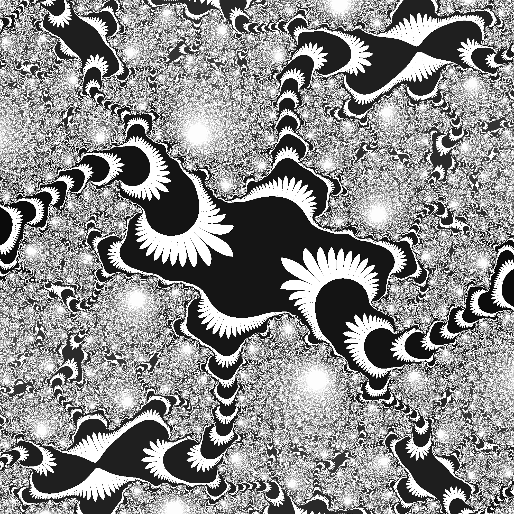

# PNG

provides a simple function for creating png images:

```rust
pub use png;

use png::RGBA;

use rand::Rng;

fn main() {
    fn random_pixel() -> RGBA {
        let mut rng = rand::thread_rng();
        RGBA {
            red: rng.gen(),
            blue: 128,
            green: rng.gen(),
            alpha: rng.gen(),
        }
    }
    let mut data = Vec::new();
    let height = 250;
    let width = 250;
    for _ in 0..(height * width) {
        data.push(random_pixel());
    }
    png::create_image(data, width, height);
}
```

results in


A fractal generated using this code:

```rust
pub use png;

use std::fs::File;
use std::io::prelude::*;

use png::RGBA;

#[derive(Clone, Copy, Debug)]
struct Complex {
    real: f64,
    imaginary: f64,
}

impl Complex {
    fn multiply_by_real(&self, by: f64) -> Complex {
        Complex {
            real: &self.real * by,
            imaginary: &self.imaginary * by,
        }
    }

    fn square(&self) -> Complex {
        self.multiply_by_complex(*self)
    }

    fn multiply_by_complex(&self, by: Complex) -> Complex {
        Complex {
            real: (self.real * by.real - self.imaginary * by.imaginary),
            imaginary: (self.real * by.imaginary + self.imaginary * by.real),
        }
    }

    fn add_to_real(&self, to: f64) -> Complex {
        Complex {
            real: self.real + to,
            imaginary: self.imaginary,
        }
    }

    fn add_to_complex(&self, to: Complex) -> Complex {
        Complex {
            real: self.real + to.real,
            imaginary: self.imaginary + to.imaginary,
        }
    }

    fn magnitude(&self) -> f64 {
        (self.real.powi(2) + self.imaginary.powi(2)).sqrt()
    }
}

impl Default for Complex {
    fn default() -> Self {
        Complex {
            real: 0.,
            imaginary: 0.,
        }
    }
}
fn seems_to_converge(c: Complex) -> bool {
    c.magnitude() < 10.
}

fn strange_converge(c: Complex) -> bool {
    c.real.abs() < 10. || c.imaginary.abs() < 10.
}

fn get_pixel_color(x: i32, y: i32, width: i32, height: i32) -> RGBA {
    let center_x = 0.0;
    let center_y = 0.0;
    let scale_factor: f64 = 1. / (2f64).powi(13);

    let (mut a, mut b, mut c, mut d, mut e, mut f, mut g) = (
        Complex::default(),
        Complex::default(),
        Complex::default(),
        Complex::default(),
        Complex::default(),
        Complex::default(),
        Complex::default(),
    );

    let mut z = Complex {
        real: f64::from(x - width / 2) * scale_factor - center_x,
        imaginary: f64::from(y - height / 2) * scale_factor - center_y,
    };

    // book suggests 0.35 + 0.35i
    let u = Complex {
        real: 0.35,
        imaginary: 0.351,
    };

    let amount_iterations = 200;
    let mut result_i = amount_iterations - 1;
    for i in 0..amount_iterations {
        a = z;

        b = a.square().add_to_complex(u);
        e = a.square().add_to_complex(u);
        c = e.square().add_to_complex(u);
        b = c.square().add_to_complex(u);
        f = c.square().add_to_complex(u);
        d = f.square().add_to_complex(u);
        d = b.square().add_to_complex(u);
        e = d.square().add_to_complex(u);
        a = f.square().add_to_complex(u);

        z = a;

        if !seems_to_converge(z) {
            result_i = i;
            break;
        }
    }
    // convert integer in range [0, amount_iterations) to [0, 256)
    let color = 255. / f64::from(amount_iterations) * f64::from(result_i);

    let color: u8 = color as u8;
    if strange_converge(c) {
        RGBA {
            red: color,
            blue: color,
            green: color,
            alpha: 255,
        }
    } else {
        RGBA {
            red: 255,
            blue: 255,
            green: 255,
            alpha: 255,
        }
    }
}

fn main() {
    let mut data = Vec::new();
    let height = 2000;
    let width = 2000;

    for y in 0..height {
        for x in 0..width {
            let pixel = get_pixel_color(x, y, width, height);

            data.push(pixel)
        }
    }

    let image_data = png::create_image(data, width, height);

    let file_path = "./images/fractal2.png";

    let mut png_file = File::create(file_path)
        .unwrap_or_else(|_| panic!("Could not create/write to `{}`", file_path));

    png_file
        .write_all(&image_data[..])
        .unwrap_or_else(|_| panic!("Could not write to `{}`", file_path));
}
```


