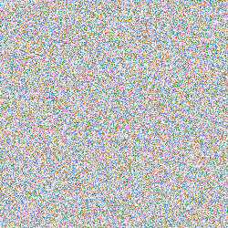

# PNG

provides a simple function for creating png images:

```rust
mod png;

use png::RGBA;
use rand::Rng;
fn main() {
    fn random_pixel() -> RGBA {
        let mut rng = rand::thread_rng();
        RGBA {
            red: rng.gen(),
            blue: rng.gen(),
            green: rng.gen(),
            alpha: rng.gen(),
        }
    }
    let mut data = Vec::new();
    let height = 1000;
    let width = 1000;
    for _ in 0..(height * width) {
        data.push(random_pixel());
    }
    png::create_image(data, width, height);
}
```

results in


